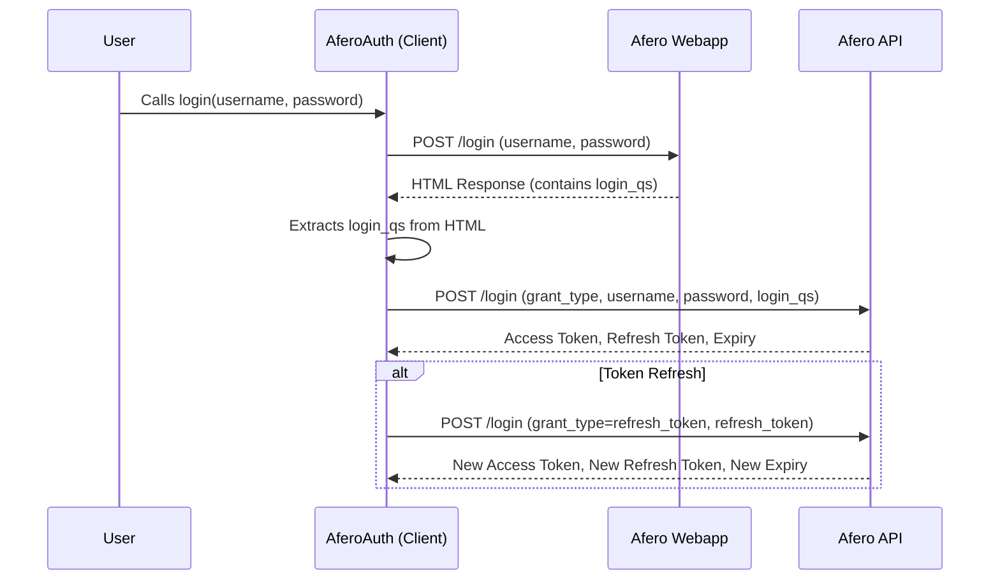

# Authentication Sequence Diagram

This document details the authentication flow for the Afero API, as implemented in the `aioafero` library.

## Sequence Diagram

## URLs Involved in Authentication

*   **Web App Login:**
    *   **URL:** `https://webapp.afero.io/login`
    *   **Method:** `POST`
    *   **Purpose:** Initial login to the Afero web application to obtain a `login_qs` (query string) which is then used for API authentication.

*   **API Login and Token Refresh:**
    *   **URL:** `https://api.afero.io/v1/login`
    *   **Method:** `POST`
    *   **Purpose:**
        *   **Initial API Login:** Exchanges username, password, and the `login_qs` (obtained from web app login) for an `access_token` and `refresh_token`.
        *   **Token Refresh:** Uses the `refresh_token` to obtain a new `access_token` when the current one expires.
