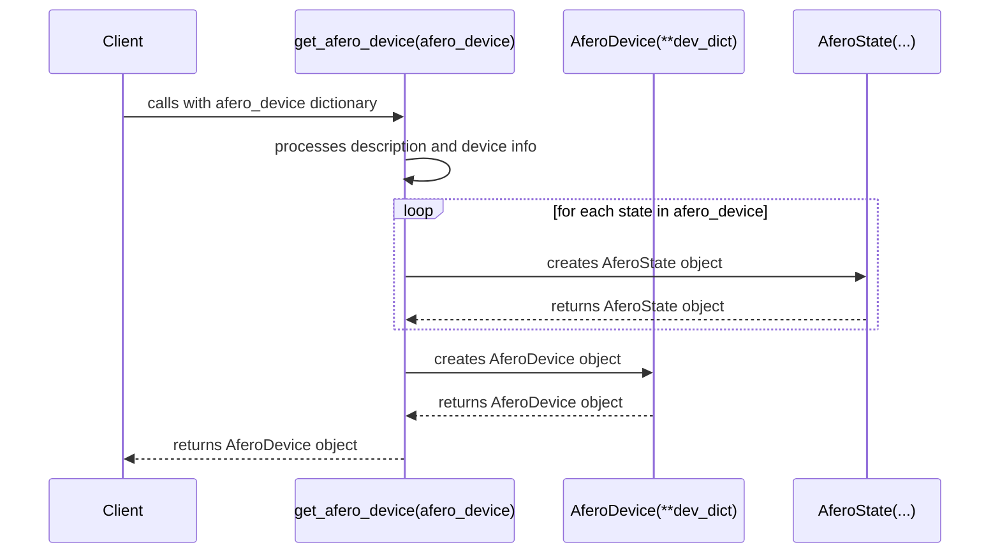

# Device Module

The `device` module provides the core data structures for representing Afero devices and their states.

## `get_afero_device(afero_device)`

This function takes a dictionary representing an Afero device and converts it into an `AferoDevice` object.

