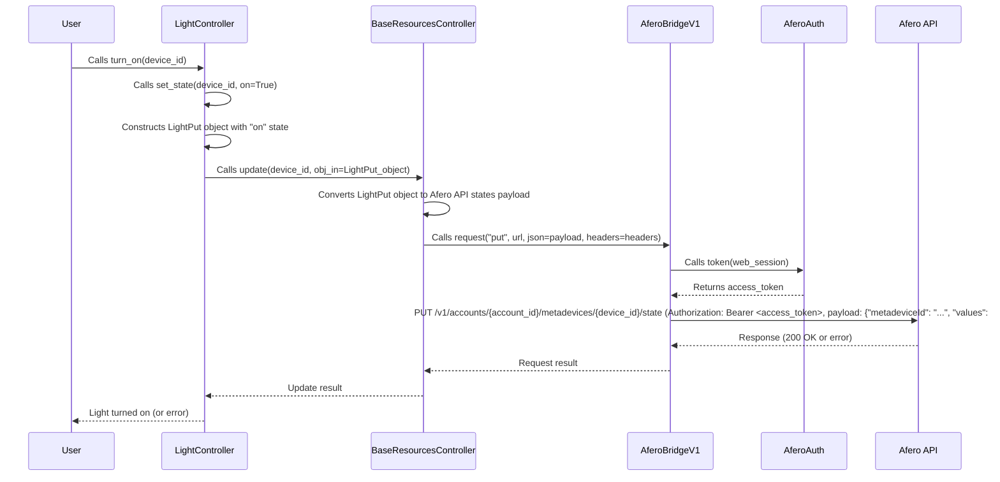

# Light Controller Sequence Diagram

This document details the interaction flow for controlling light devices within the `aioafero` library, specifically focusing on the `LightController`.

## Sequence Diagram: Light Control (e.g., Turning On a Light)

## URLs Involved in Light Control

*   **URL Pattern:**
    *   For `hubspace` client: `https://api2.afero.net/v1/accounts/{account_id}/metadevices/{device_id}/state`
    *   For `myko` client: `https://api2.sxz2xlhh.afero.net/v1/accounts/{account_id}/metadevices/{device_id}/state`
*   **Method:** `PUT`
*   **Purpose:** To update the state of a specific light device (e.g., turn on/off, set brightness, color, etc.). The `{account_id}` and `{device_id}` are placeholders that are dynamically inserted at runtime. The payload will contain specific `functionClass` and `value` pairs relevant to light attributes (e.g., `"functionClass": "power", "value": "on"` for turning on, `"functionClass": "brightness", "value": 50` for setting brightness).
