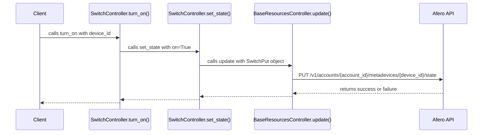

# Switch Controller

The `switch` module provides the `SwitchController` class, which is responsible for managing Afero switch devices.

## `turn_on(device_id, instance=None)`

This method turns on a specific switch or a specific instance of a switch.

