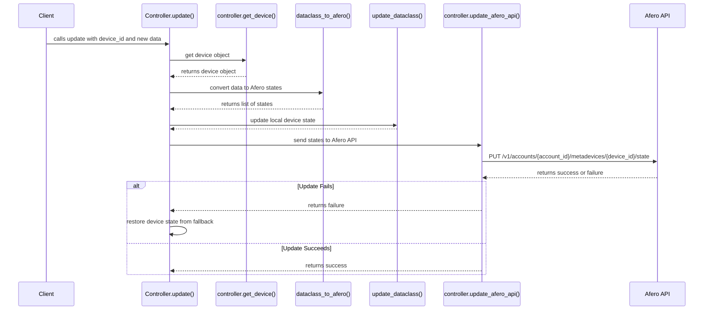

# Base Controller

The `base` module provides the `BaseResourcesController` class, which is the foundation for all device-specific controllers. It handles event subscription, device state updates, and communication with the Afero API.

## `update(device_id, obj_in)`

This method is responsible for updating the state of a device. It takes the `device_id` and a data object `obj_in` containing the new values.

