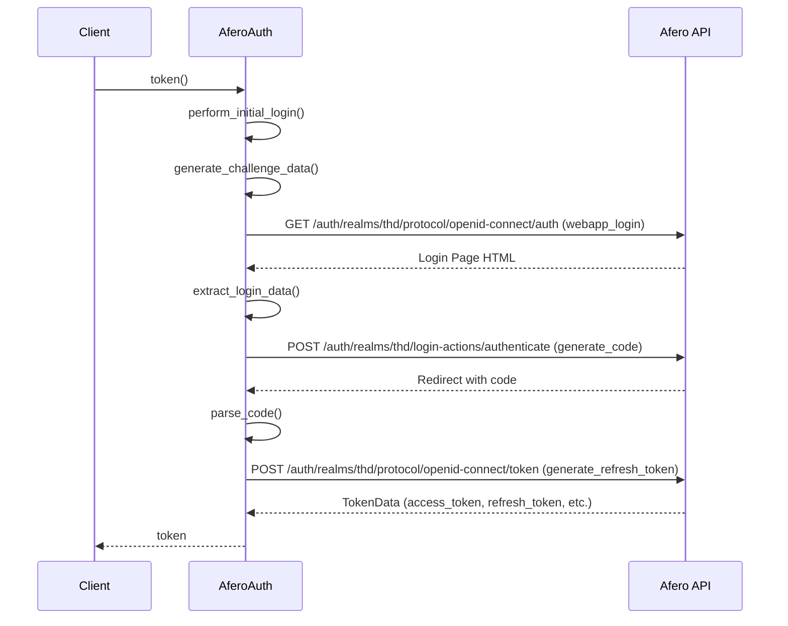
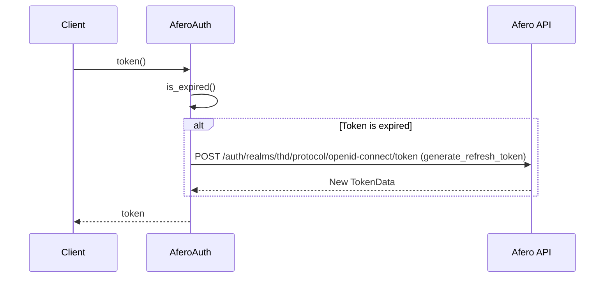
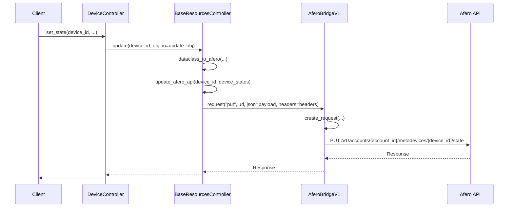

# Sequence Diagrams

This document contains sequence diagrams that illustrate the interaction between the `aiofero` library and the Afero API.

## Authentication

### Initial Login

### Refresh Token

## Device Control

